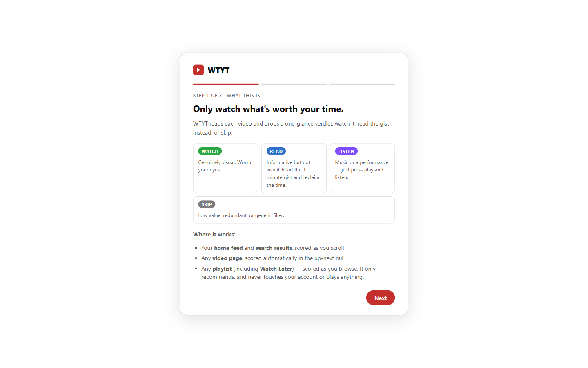
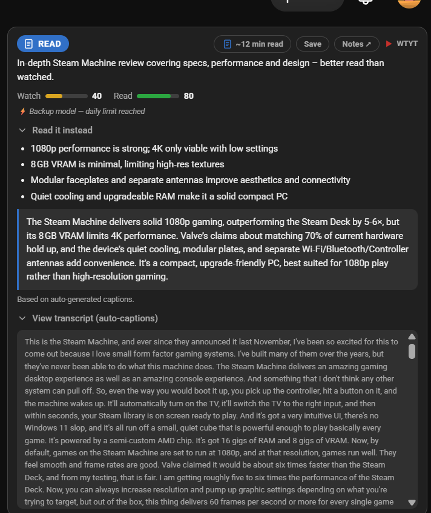
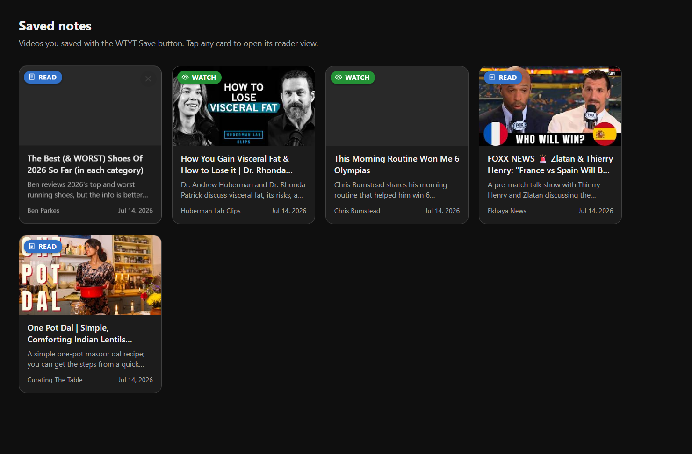
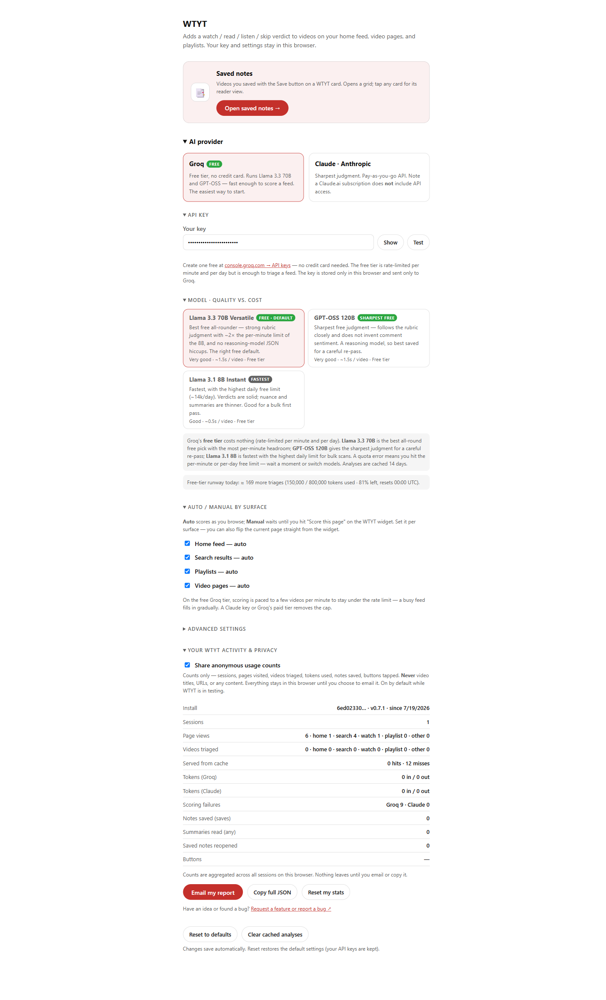

# WTYT

**A watch / read / listen / skip verdict on every YouTube video, so you spend time only on what earns it.**

WTYT is a Chromium extension (Chrome, Edge, Brave) that reads each video and drops a one-glance
verdict on your **home feed**, your **search results**, any **video page**, and any **playlist** —
and for the ones you'd only skim, hands you a written distillation instead.


It never touches your account or plays anything — it reads, scores, and tells you.

**Jump to:** [Install](#install) · [The verdict](#the-verdict) · [Read it later](#read-it-save-it-come-back-to-it) · [Bring your own key](#bring-your-own-ai-key) · [For builders](#for-builders) · [Limitations](#known-limitations) · [What's new](CHANGELOG.md)

---

## Install

1. Clone or download this repo → `chrome://extensions` → enable **Developer mode** → **Load unpacked** → pick the folder with `manifest.json`.
2. Onboarding opens → choose **Groq** (free, [console.groq.com/keys](https://console.groq.com/keys)) or **Claude** (paid, [platform.claude.com](https://platform.claude.com/settings/keys)), paste your key, hit **Test**.
3. Open your feed, a search, a video, or a playlist. Most surfaces score on their own; playlists use the **WTYT · Analyze playlist** button.

> **New in 0.7.1:** search-results scoring, LIVE / UPCOMING markers, and a free-tier runway meter — see the **[changelog](CHANGELOG.md)** for the full history.



---

## The verdict

**WATCH** — visual, worth the minutes. **READ** — informative but not visual, so a distillation is
included and you reclaim the time. **LISTEN** — music or a live set, where watch/read scoring doesn't
apply, so it gets its own minimal card. **SKIP** — low value, redundant, or generic filler.

Underneath, three 0–100 axes (watch, read, generic) feed the verdict, plus a gated **AI-generated
badge** that only shows when multiple signals agree — a wrong label does more damage than a missed
one. A **secondary tag** ("also a strong read") is computed in code from the scores, not asked of the
model, so it can't drift across providers of very different capability. On high-view videos the top
~20 comments are pulled as a **cross-check** — commenters reliably flag AI voices and re-uploads — and
omitted entirely on low-view ones rather than sent empty.

**Live streams and premieres** get a LIVE / UPCOMING marker instead of a score: there's no finished
transcript to read yet, so WTYT flags them and skips the call rather than waste it.

## Read it, save it, come back to it

Click the "~N min read" chip (or the verdict pill) and a reader overlay opens in place — transcript,
summary, takeaways — without leaving the page or handing your data to a "read it later" service. Hit
**Save** and it's kept locally, in a namespace separate from the analysis cache, so clearing the cache
to force a rescore can never wipe something you saved. A notes page (thumbnail grid, tap to reopen) is
reachable from any card.





## Bring your own AI key

WTYT sends each transcript to a model you choose, not one it ships baked in:

| Provider | Cost | Default model | Notes |
|----------|------|---------------|-------|
| **Groq** | **Free tier** | Llama 3.3 70B | No credit card. Hit the free daily limit? WTYT walks a fallback chain (70B → GPT-OSS 120B → Llama 3.1 8B) automatically and just notes the backup on the card. A **"≈ N left today"** meter shows your remaining free runway. |
| **Claude (Anthropic)** | Paid API | Claude Haiku 4.5 | Sharpest judgment when you want it — Haiku ≈ $0.006/video; Sonnet 5 for a curated re-pass. |

Your key lives in `chrome.storage.local` and is sent straight to the provider from the extension's own
service worker — it never enters page context, and there's no middle-man server to trust or host. Both
providers share **one prompt and one JSON contract**, so adding a third is a small, mechanical change.

Free models cap out **per day**, not just per minute — a wall a simple retry-with-backoff can't wait
out. That's the real reason the fallback chain and the runway meter exist: together they're what make
"free, no credit card" hold up under real use instead of a demo that breaks the first busy afternoon.



---

## For builders

Fork-friendly on purpose — vanilla JS, no build step, no framework, no bundler. Clone it, edit a file,
reload the extension.

### Architecture

```text
any YouTube surface (home / search / watch / playlist)
  content.js   routes by URL, scans video rows ─▶ per video:
    yt-data.js   fetch watch page (same-origin, your cookies) ─▶ transcript
                   · web caption track first, ANDROID InnerTube client as fallback
                 high-view video? ─▶ top comments as a cross-check
    background.js (service worker) ─▶ Groq or Anthropic (your key) ─▶ JSON scores,
                   walking the free-tier fallback chain on a daily cap
    cards.js     inject the report card into the row (createElement only)
    reader.js / notes-store.js   reader overlay + local saved notes
```

| File | Responsibility |
|------|----------------|
| `src/content.js` | Surface router (home / search / watch / playlist) + the scan → score → render loop. |
| `src/yt-data.js` | The scraping layer — dual-markup DOM parsing, transcript retrieval, comments fetch. |
| `src/background.js` | The only place the key is used — provider routing, the scoring prompt, the deterministic guards, the fallback chain, the daily runway. |
| `src/cards.js` | All rendering — `createElement` only. |
| `src/reader.js` / `src/notes-store.js` | Reader overlay + local saved-notes store. |
| `src/models.js` | Single source of truth for the provider/model catalog, so settings and onboarding can't drift apart. |
| `src/options.*`, `src/welcome.*` | Settings page and onboarding wizard. |

### A few decisions worth calling out

- **No backend, bring-your-own-key.** The key lives in `chrome.storage.local` and the API call runs from the **service worker**, not the page — so it never enters page context and there's no server to trust. Transcripts and comments are fetched same-origin with your own cookies, so there's no OAuth and nothing to host.
- **The free tier survives its own limits.** Groq's free models cap out per *day*, not just per minute — a hard wall a simple retry can't wait out. `background.js` walks a fallback chain (70B → 120B → 8B) so one model's daily cap doesn't stop scoring, and the runway meter shows what's left before it does.
- **Deterministic guards over trusting the model.** `read_instead` is forced empty unless the verdict is `read`, the comment cross-check is dropped whenever no comments were sent, and the secondary tag is computed from the returned scores — so nothing drifts across providers of very different capability.
- **Dual-markup DOM resilience.** YouTube ships DOM changes continuously and has flip-flopped the playlist page between `yt-lockup-view-model` and `ytd-playlist-video-renderer`. Rather than bet on one, the scanner parses **both** at runtime. (Learned the hard way.)
- **Cache correctness over cache size.** Analyses key on `provider:model:videoId`, not just `videoId`, so switching providers or models always rescores instead of silently showing the other one's stale verdict.

Extending it: add a provider with a `*Complete()` in `background.js` plus a `models.js` entry; the
rubric is one `SYSTEM_PROMPT` string; DOM selectors are isolated in `yt-data.js`.

### Known limitations

- No-caption videos (music, many Shorts) are scored from metadata only, flagged on the card with lower confidence.
- Selectors track the mid-2026 YouTube layout with fallbacks; selector rot is a fact of life when scraping a site you don't control.
- Scores the rows currently rendered — scroll a long playlist before analyzing.
- Personal-scale tool: no multi-tenancy, no auth hardening. It recommends — it never auto-acts.

---

## Built with AI, directed by humans

This project was built with the help of AI coding tools, but it was **thought out, decided, designed,
tested, and vetted by a human**. Every architectural choice, product decision, and the verification
behind them are the author's own.

## License

MIT © 2026 Vemana Madasu — see [LICENSE](LICENSE).
