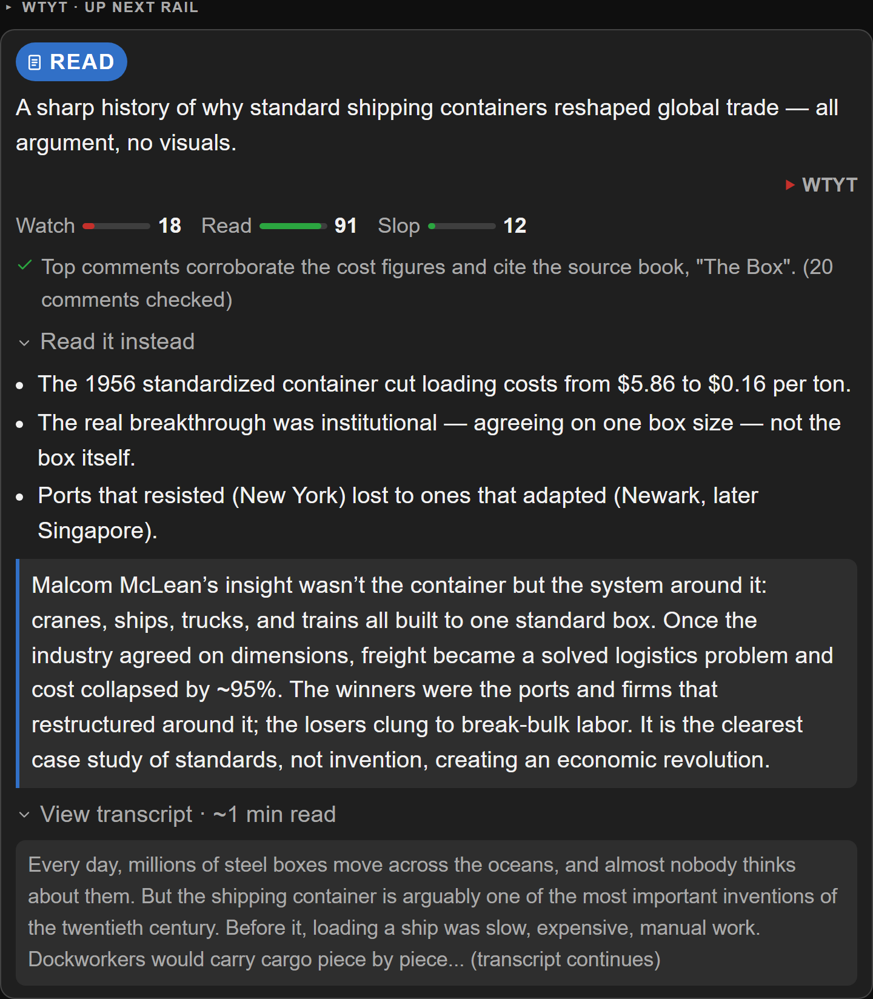

# WTYT — Watch The YouTube Things

**Give every YouTube video a watch / read / skip verdict, so you spend your time only on what's worth it.**

WTYT is a browser extension for Chrome, Edge, Brave, and other Chromium browsers. It reads
each video and drops a one-glance verdict on your **home feed**, on any **video page**, and
on any **playlist** — then, for the ones you'd otherwise skim, hands you a written
distillation so you can reclaim the time.



- **WATCH** — genuinely visual, worth the minutes.
- **READ** — informative but not visual; a distillation is included, reclaim the time.
- **SKIP** — low value, redundant, or slop.

It never touches your account or plays anything. It only reads, scores, and tells you.

---

## For everyone: what it does

### What each card shows

- **Verdict** — WATCH / READ / SKIP.
- **Watch score** (0–100) — how much the value depends on actually watching. An essay read
  over a black screen is a 0; an "Every Frame a Painting"-class visual piece is 100.
- **Read score** (0–100) — how fully the essence survives as a short written distillation.
- **Slop score** (0–100) — how likely the script/narration is low-effort, AI-content-farm output.
- **Community check** — for high-view videos, the top ~20 comments are pulled and used to
  cross-examine the scores (commenters reliably flag AI voices, re-uploads, and factual
  errors). The card notes whether the community agrees.
- **Key takeaways + "read it instead"** — expandable, so the card stays compact.

### Bring your own AI key

WTYT sends each transcript to an AI model you choose. Two providers are supported:

| Provider | Cost | Default model | Notes |
|----------|------|---------------|-------|
| **Groq** | **Free tier** | GPT-OSS 120B | No credit card. OpenAI-compatible, native JSON mode. Best free judgment; Llama 3.1 8B is the fastest bulk option. Rate-limited per minute/day. |
| **Claude (Anthropic)** | Paid API | Claude Haiku 4.5 | Sharpest judgment. Haiku ≈ $0.006/video; Sonnet 5 for a curated re-pass. |

Your key is stored in `chrome.storage.local` only and sent straight to the provider
(`api.groq.com` or `api.anthropic.com`) from the extension's own service worker — there is
no middle-man server.

### Install (load unpacked)

1. Clone or download this repo.
2. `chrome://extensions` → enable **Developer mode**.
3. **Load unpacked** → select the repo folder (the one with `manifest.json`).
4. Onboarding opens → pick **Groq** (free) or **Claude**, paste your key, hit **Test**.
   - Groq key: [console.groq.com/keys](https://console.groq.com/keys) — free, no card.
   - Claude key: [platform.claude.com](https://platform.claude.com/settings/keys) — paid API, set a spend cap.
5. Open your home feed, a video, or a playlist. Scoring starts on its own (playlists use the
   **WTYT · Analyze playlist** button).

### Settings

| Setting | Default | Notes |
|---------|---------|-------|
| Provider / model | Groq · GPT-OSS 120B | Switch anytime; per-provider keys kept separately. |
| Auto-analyze | On | Home + watch pages score automatically; off makes them wait for a button. |
| Home batch size | 16 | Scores this many, then offers a "Continue" button. |
| Max videos per playlist run | 25 | Playlist order, top down. |
| Comment-check threshold | 100,000 views | At/above this, top comments are pulled as a cross-check. |

---

## For builders: how it works

Fork-friendly by design — vanilla JS, no build step, no framework, no bundler. Clone it, edit a file, reload the extension. Everything below is the reasoning behind the code, so you can extend it without reverse-engineering the decisions.

### Architecture

```text
any YouTube surface (home / watch / playlist)
  content script (content.js) routes by URL and scans video rows ─▶ per video:
    yt-data.js  fetch watch page (same-origin, your cookies) ─▶ transcript
                  · web caption track first
                  · ANDROID-client InnerTube player as fallback (no proof-of-origin token)
                high-view video? ─▶ top comments via /youtubei/v1/next continuation
    background.js (service worker) ─▶ Groq or Anthropic (your key) ─▶ JSON scores
    cards.js    inject the report card into the row (createElement only)
```

| File | Responsibility |
|------|----------------|
| `src/content.js` | Surface router (home / watch / playlist) + orchestration; owns the scan → score → render loop and the injection lifecycle. |
| `src/yt-data.js` | The scraping layer — DOM parsing for every surface, transcript retrieval, and the comments fetch. All same-origin. |
| `src/background.js` | The only place the API key is used. Provider routing, the scoring prompt, JSON parsing, and the deterministic guards. |
| `src/cards.js` | All rendering — the three card variants, built with `createElement` (never `innerHTML`). |
| `src/models.js` | Single source of truth for the provider/model catalog, costs, and copy — so settings and onboarding never drift. |
| `src/options.*`, `src/welcome.*` | Settings page and onboarding wizard. |

### Engineering decisions

The non-obvious calls, and why they were made that way:

- **No backend, bring-your-own-key.** Zero infrastructure and a clean privacy story: the key
  lives in `chrome.storage.local`, and the API call is made from the **service worker**, not
  the page — so the key never enters page context, and `host_permissions` makes CORS a
  non-issue. Transcripts and comments are fetched same-origin with the user's own cookies, so
  there's no OAuth and nothing to host.

- **Provider abstraction, not provider lock-in.** Claude and Groq share one prompt and one
  JSON contract; only the HTTP shape differs. Routing keys off the model id (`claude*` →
  Anthropic, else Groq) so a stale saved provider can't wedge the extension. Groq is the
  default because its free tier plus native JSON mode make it the only genuinely no-paid-key
  path.

- **Deterministic guards over trusting the model.** Two correctness rules are enforced in
  code, not in the prompt: `read_instead` is forced empty unless the verdict is `read`, and
  `community_check` is dropped whenever no comments were sent. This makes the output robust to
  weaker open models that would otherwise fabricate comment sentiment or leak a distillation
  onto a SKIP.

- **Dual-markup DOM resilience.** YouTube ships DOM changes continuously and has flip-flopped
  the playlist page between `yt-lockup-view-model` and `ytd-playlist-video-renderer` more than
  once. Rather than bet on one, the scanner detects and parses **both** at runtime. (This one
  was learned the hard way.)

- **Transcript fallback via the ANDROID InnerTube client.** Since 2025, web caption URLs often
  return an empty `200` without a proof-of-origin token. The ANDROID client's caption URLs
  carry no such requirement, so it's the reliable path when the web track comes back blank.

- **Trusted Types compliance.** YouTube enforces Trusted Types, so any `innerHTML` from a
  content script throws. Every injected node is built with `createElement` / `textContent` and
  SVGs via `createElementNS`.

- **Measured, not assumed.** Prompt caching was investigated and *rejected*: the scoring rubric
  (~700 tokens) sits under Haiku 4.5's 4,096-token cacheable floor, so caching would silently
  no-op. Results are instead cached per video for 14 days, which is where the real re-open win is.

- **Non-disruptive injection.** The floating button is `position: fixed` and never enters
  YouTube's header DOM, so nothing reflows; cards mount inside each row's own metadata column;
  the theme follows YouTube's `html[dark]` attribute with colors matched to its real palette.

### Extending it

- **Add a provider:** add a `*Complete()` function in `background.js` mirroring
  `groqComplete`, extend `providerOf()` routing, and add its catalog entry to `models.js`.
- **Change the rubric:** the scoring axes and verdict rules live in one `SYSTEM_PROMPT` string
  in `background.js`; the JSON shape is enforced right below it.
- **Support a new surface / fix selector rot:** DOM selectors are isolated in `yt-data.js`;
  the surface router is the top of `content.js`.

### Known limitations

- Videos without captions (music, many Shorts) are scored from metadata only, flagged on the
  card with lower confidence.
- Selectors are verified against the mid-2026 YouTube layout with fallbacks; selector rot is a
  maintenance fact of life when scraping a site you don't control.
- Analyzes the videos currently rendered (YouTube lazy-loads rows; scroll before analyzing a
  long playlist).
- Personal-scale tool: no multi-tenancy, no auth hardening. It recommends — it never auto-acts.

---

## Built with AI, directed by humans

This project was built with the help of AI coding tools, but it was **thought out, decided, designed, tested, and vetted by a human**. Every architectural choice, product decision, and the verification behind them are the author's own.

## License

MIT © 2026 Vemana Madasu — see [LICENSE](LICENSE).
